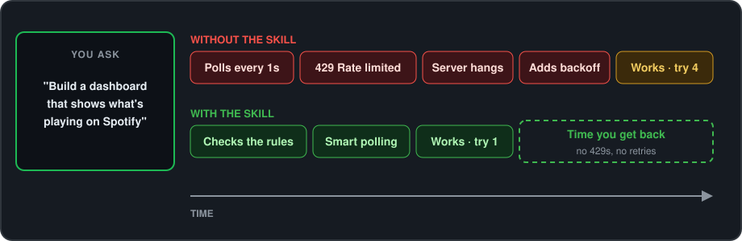

# 🎧🤖 Spotify Web API Agentic Skill


> An Agent Skill that teaches your AI assistant to build Spotify apps that stay fast, stay under the rate limit, and don't break in odd ways.

[](LICENSE.txt) [](https://github.com/anthropics/skills) [](https://github.com/adriangrantdotorg/spotify-web-api-ai-skill/releases) [](https://github.com/adriangrantdotorg/spotify-web-api-ai-skill/pulls)

---

## ⬇️ Why Install?

- 🚦 **Fewer 429 errors** — polls and pages the way Spotify's limits expect
- 💸 **$0 added cost** — it runs on the AI you already use
- 📅 **Current with 2026 endpoints** — playlist `/items`, not the deprecated `/tracks`
- 🧠 **Lessons from real apps** — fixes for bugs that docs never mention

| | 😩 Without this Skill | 😌 With this Skill |
| --- | :---: | :---: |
| 🔁 Tries until it stops hitting 429s | 🧪 3–5 | **1** |
| 📄 Calls to read a 1,000-track playlist | 50 (default `limit=20`) | **10** (`limit=100`) |
| 🙈 Polls per hour in a hidden tab | 360 | **60** |
| ⚡ Page switch, "now playing" | 🧪 ~350 ms | **🧪 ~2 ms** |

<sub>🧪 estimate</sub>

---

## ✨ Features

Before your AI writes Spotify code, it checks rules drawn from real dashboards and scripts, so the first version already handles limits, lag and edge cases.



- 🚦 **Rate limits handled for you** — fail fast, read `Retry-After`, show the user a countdown
- 🔄 **Smart polling** — every 10 s while visible, every 60 s when the tab is hidden
- ⚡ **Instant page switches** — a 5-second server cache plus a saved last track
- 🗂️ **"Which playlists have this song" that survives restarts** — a saved cache, never faked as empty
- 🎛️ **Controls that don't flip back** — holds a repeat or shuffle change until Spotify catches up
- ⏮️ **No false errors on Previous or Next** — "Restriction violated" restarts the track instead
- 🔐 **Safe token sharing** — a second tool borrows the login and never refreshes it

---

## 🚀 Installation

Needs an AI assistant that supports [Agent Skills](https://github.com/anthropics/skills). The apps it builds need a [Spotify developer app](https://developer.spotify.com/) (client ID, client secret, redirect URI).

```bash
git clone --depth 1 https://github.com/adriangrantdotorg/spotify-web-api-ai-skill.git
cp -R spotify-web-api-ai-skill/skill/spotify-web-api ~/.claude/skills/
```

Other platforms: copy the same `skill/spotify-web-api` folder into the folder below.

| **Platform** | **Skills folder** |
| --- | --- |
| **Claude Code** | `~/.claude/skills/` |
| **Claude.ai** | Settings ▸ Capabilities ▸ Skills ▸ upload the folder as a ZIP |
| **Codex CLI** | `~/.codex/skills/` |
| **Gemini CLI** | `~/.gemini/skills/` |
| **OpenCode** | `~/.config/opencode/skills/` |
| **Cursor** | `.cursor/skills/` in your project |
| **Google Antigravity** | `.agent/skills/` in your project |

---

## 💡 Usage

Describe what you want; the skill kicks in on its own whenever Spotify comes up.

| You say | The skill makes |
| --- | --- |
| "Make a Flask app that shows my currently playing track." | A **fail-fast Spotipy server** that returns `Retry-After` and a UI countdown on 429 |
| "Build a dashboard that polls my playback state." | A **smart-polling dashboard** with instant page switches and a saved last track |
| "Write a script that moves the selected tracks to another playlist." | A **playlist mover** on `/items` that puts tracks back if the add fails |

---

<div align="center">
  <sub>Built with ❤️ for Music Lovers & the Open Source Community ✌🏾</sub>
</div>
